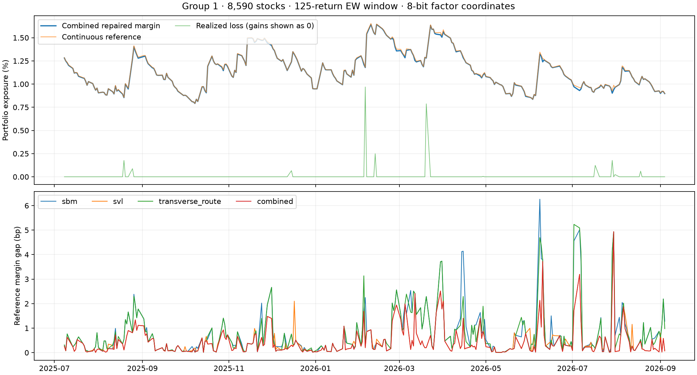

# Full Group 1 factor-stress backtest

Completed all **294 eligible dates**, **2025-07-08–2026-09-04**, for a fixed random long-only portfolio of 8,590 stocks (seed 20260910, total exposure 1). The first 126 price dates are calibration warmup. Each fit uses exactly 125 prior daily returns (`ew_window=125`, decay 0.93) and excludes the evaluation close.

## Configuration

Eight V100 GPUs; SBM, SVL and TRF; 32 trajectories, 10,000 steps and 3 seeds per solver/date: **2,646 QUBO solves**. Coordinates use 8-bit encoding: 2 PCA factors plus 1 portfolio residual coordinate, **122 variables and 7,381 edges**. Radius 3 is unchanged. Projection, auxiliary reconstruction and feasible exact-P&L descent are applied to every raw result.

Penalty multiplier **1e-11** was selected from the earlier sweep by the smallest mean repaired-margin shortfall from the continuous reference at 8 bits, averaged across solvers and seeds. Actual daily penalty is `multiplier × 1.1 × objective coefficient absolute-sum bound`. This weak penalty relies on repair for feasibility. See [penalty ranking](penalty_ranking.csv).

## Daily results

Each solver's daily margin is the maximum repaired loss over its three seeds. The combined series takes the maximum over all nine candidates, selected without consulting realized loss. A breach is strictly `realized loss > margin`; equality is not a breach. Returns compare the prior available close with the evaluation close.

| Method | Dates | Breaches | Breach rate | Mean margin | Mean reference gap (bp) |
|---|---:|---:|---:|---:|---:|
| combined | 294 | 0 | 0.00% | 1.145804% | 0.4421 |
| torch_sbm | 294 | 0 | 0.00% | 1.142442% | 0.7783 |
| torch_svl | 294 | 0 | 0.00% | 1.145429% | 0.4796 |
| torch_transverse_route | 294 | 0 | 0.00% | 1.142937% | 0.7288 |

All **2,646/2,646 repaired encodings are feasible**; 2,646 reached a local optimum within the repair cap. These are local optima on the integer lattice, not guaranteed global worst losses.

The 20 dates used to select the penalty are included in the full period. [Summary CSV](summary.csv) reports them and the other 274 dates separately. This is a retrospective fixed-penalty replay, not a prospective test. The radius is illustrative and was not recalibrated to a target breach probability.

The supplied prices produce realized portfolio returns from **-0.9691%** to **990.9822%**. The extreme positive returns are present in the source data; they are not margin breaches. [Largest realized moves and their asset contributions](largest_realized_moves.csv) records the prices and weights behind them for data-quality review. No price corrections were applied.

## Timing

- Shared preparation: **513.254 s**.
- Eight-GPU worker phase, including startup: **81.321 s**.
- Raw benchmark wall time: **594.980 s**.
- Sequential CPU repair pass: **10.546 s**.
- Raw benchmark plus repair: **605.525 s (10.09 minutes)**.
- Sum of the four remote phases, including interpreter startup and both independent verifications: **616.68 s (10.28 minutes)**.

The raw benchmark includes continuous and exhaustive quadratic-lattice references for every date. Summed GPU solve work is 545.564 s and overlaps across eight workers. Inclusive timing rows overlap and must not be added. Per-trial solve times are amortized batch time, not measured individual latency. Independent sample verification is included only in the four-phase total. Transfer and final daily report generation are additional.

## Verification and artifacts

Raw and repaired samples were independently verified on the remote server. This daily report independently checks coverage of every eligible dataset date, 125-return calibration boundaries, realized P&L against source prices, complete solver/seed combinations, and direct breach comparisons.

- [Daily margins](daily_margins.csv), [breaches](breaches.csv), [summary](summary.csv).
- [Timing breakdown](timing_breakdown.csv), [daily timing work](daily_timings.csv), [remote workflow timing](workflow_timing.json).
- [Raw trials](results/trials.csv), [repaired trials](repair_results/trials.csv).
- [Daily verification](verification.json), [raw verification](results/verification.json), [repair verification](repair_results/verification.json).
- [Exact invocation](run_remote.sh), [settings and eligible dates](plan.json), [remote log](run.log).
